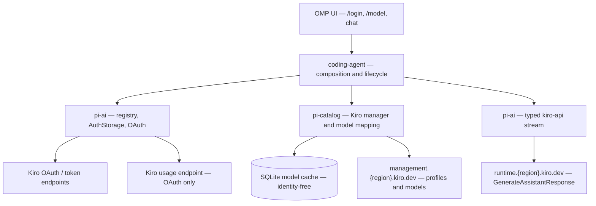
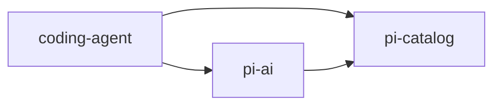
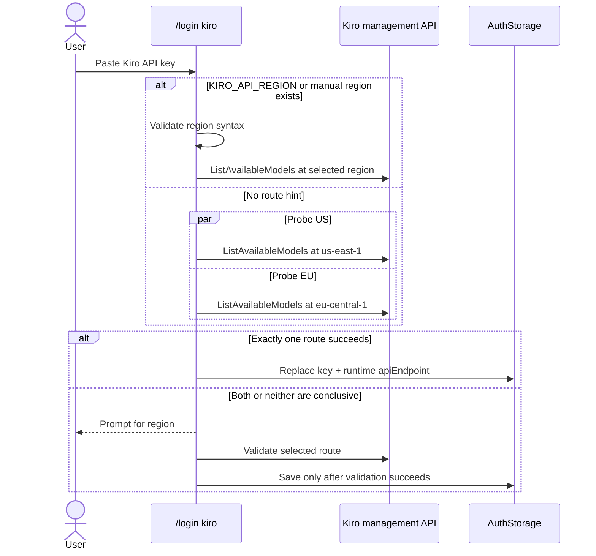
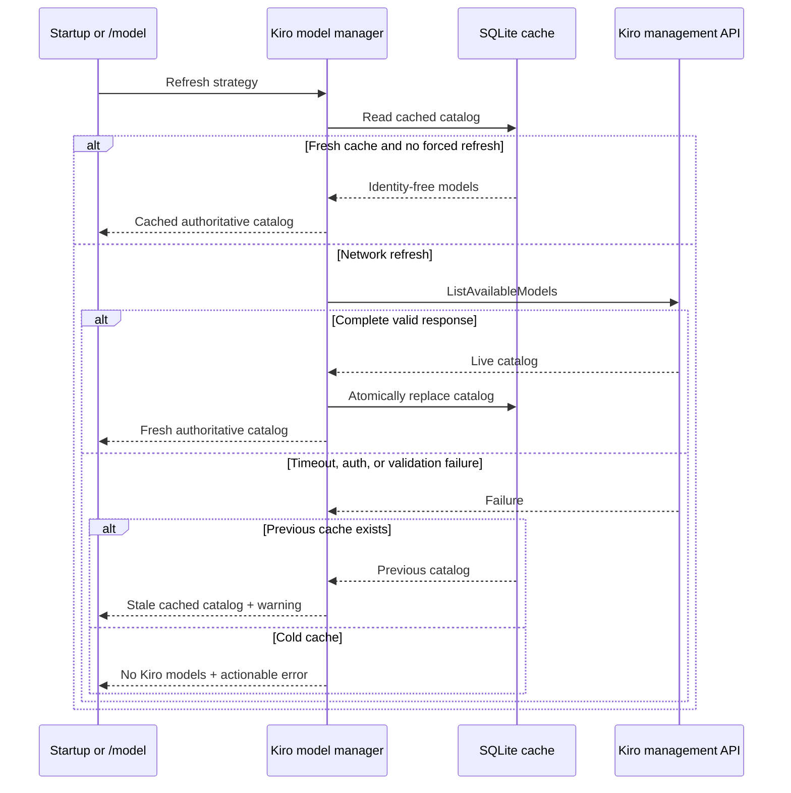

> [!IMPORTANT]
> This is an implementation-ready architecture for the fork. It is **not upstream maintainer approval**. Kiro's management/runtime APIs are unofficial, and upstream currently requires major features to be discussed in Discord before implementation.

## Summary

Add Kiro to OMP core as a first-class, dedicated provider:

- Provider ID: `kiro`
- Typed API ID: `kiro-api`
- Inference transport: direct calls to Kiro's management/runtime APIs
- Authentication: `KIRO_API_KEY`, pasted API key, and OMP-managed Kiro OAuth
- Model catalog: authoritative live `ListAvailableModels` discovery
- Account scope: one active Kiro credential/profile; no rotation or failover
- Usage: OAuth-only in v1
- Kiro CLI: not used as an inference transport and not read for credentials in v1

This is a port/refactor of the proven [`omp-provider-kiro`](https://github.com/ajdiyassin/omp-extension-kiro/tree/dbaad295b1955113883ddf2d254a78f6dec25f76) implementation, not a rewrite of its protocol logic.

Related:

- Upstream request: [can1357/oh-my-pi#4676](https://github.com/can1357/oh-my-pi/issues/4676)
- Earlier request and maintainer questions: [can1357/oh-my-pi#1571](https://github.com/can1357/oh-my-pi/issues/1571)
- Working extension: [ajdiyassin/omp-extension-kiro](https://github.com/ajdiyassin/omp-extension-kiro)
- OMP baseline: `main` at `7504d4c` / 17.0.8
- Extension baseline: `dbaad29`

## Why native support

The extension already proves live discovery, streaming, tools, images, Claude adaptive thinking, GPT reasoning, OAuth, usage, and cache integration. Native support is valuable because it removes plugin installation and lets Kiro use OMP's built-in provider registry, `/login` UX, `AuthStorage`, refresh coordination, usage UI, typed stream dispatch, package exports, CI, and release testing.

Native support is **not** justified by a better cache. Runtime extension discovery already uses OMP's SQLite model cache. The native port should preserve that behavior rather than invent a second cache.

## Goals

- Make `kiro/<exact-model-id>` work without installing an extension.
- Provide first-class `/login kiro` for browser OAuth, headless device authorization, and pasted API keys.
- Discover the complete live catalog and schema-derived capabilities.
- Preserve exact Kiro model IDs, including IDs such as `gpt-5.6-sol`.
- Preserve working request transformation, streaming, tool calls, images, token accounting, and reasoning behavior.
- Keep credentials and profile identity owned by `AuthStorage`.
- Keep discovery/cache data identity-free.
- Fail closed on malformed or unknown recognized schemas.
- Keep the implementation maintainable as an experimental/best-effort provider.
- Preserve existing `kiro/...` selectors and explicit historical aliases.

## Non-goals

- A generic CLI-backed provider abstraction.
- Executing Kiro CLI for inference.
- Reading or writing Kiro CLI/IDE SQLite credentials in v1.
- Native Google/GitHub protocol implementations separate from Kiro's unified OAuth portal.
- Multiple stored Kiro accounts, quota rotation, or automatic account failover.
- API-key usage/quota reporting in v1.
- A static model catalog or static region availability allowlist.
- Claiming Kiro's unofficial APIs have the same stability guarantee as documented public provider APIs.
- Reworking unrelated provider/auth/catalog infrastructure.
- Using a paid inference request to detect an API-key region.

## Decisions

| Area | Decision |
|---|---|
| Integration | Dedicated direct provider; Kiro CLI is never the inference backend. |
| Support level | Built-in but explicitly experimental/best-effort because the API is unofficial. |
| Provider/API identity | `kiro` provider with first-class `kiro-api` typed dispatch. |
| OAuth | Native unified Kiro browser flow; device-code fallback for headless/SSH. |
| OAuth profile | Discover immediately after OAuth, select once, and save the validated profile ARN as `OAuthCredentials.orgId`. |
| Multiple profiles | Auto-select one; prompt when multiple; fail login when none are usable. |
| API keys | Support `KIRO_API_KEY` and pasted keys. Auto-detect region, then prompt or require a manual hint when detection is ambiguous. |
| Account behavior | One active stored Kiro credential. A successful Kiro login atomically replaces the previous stored Kiro credential. |
| Discovery | Live `ListAvailableModels`; a successful response is authoritative. |
| Default model | `auto`, when returned by the live catalog. Do not fabricate a static `auto` model when discovery has never succeeded. |
| Cache | Reuse OMP's SQLite cache with an explicit 24-hour Kiro TTL, startup restoration, manual refresh, and stale-cache retention. |
| Usage | OAuth profile-scoped usage only. |
| CLI credential reuse | Deferred; no CLI database access in v1. |
| Old extension | Actionable conflict: native OMP reserves `kiro` and `kiro-api` and instructs the user to uninstall `omp-provider-kiro`. |
| Upstream path | Build one complete PR linked to #4676. Skipping the required Discord discussion is an explicit acceptance risk. |

## Terminology

| Term | Meaning |
|---|---|
| Identity | Google, GitHub, AWS Builder ID, or IAM Identity Center identity used during OAuth. |
| Kiro profile | The subscription/backend scope represented by a CodeWhisperer `profileArn`. It is not the identity-provider account itself. |
| API region | Region used to construct `management.{region}.kiro.dev` and `runtime.{region}.kiro.dev`. |
| Bootstrap region | `us-east-1` or `eu-central-1`, used only to locate a profile or validate an API key. These are not an allowlist. |
| Discovery credential | The active bearer plus non-secret routing metadata required by `ListAvailableModels`. |
| Authoritative catalog | A complete successful live catalog that replaces the previous Kiro model set. |

## Target architecture



Dependency direction remains:



`pi-catalog` must not import `pi-ai` or `coding-agent`. Kiro discovery therefore accepts an explicit, already-resolved credential/route input; it never reaches into `AuthStorage`.

## Package ownership

### `packages/catalog`

Own identity-free catalog and wire knowledge:

- Add `kiro` to `CATALOG_PROVIDERS`.
- Add `kiro-api` to `KnownApi` in `packages/catalog/src/types.ts`.
- Mark it `specialModelManager: true` because discovery needs a token plus profile/route metadata, not only a bare API key.
- Declare `envVars: ["KIRO_API_KEY"]`.
- Set `defaultModel: "auto"` and `dynamicModelsAuthoritative: true`.
- Implement `kiroModelManagerOptions(...)`.
- Implement bounded management requests for `ListAvailableModels`.
- Own the fail-closed response/schema sanitizer.
- Map sanitized models into canonical `ModelSpec<"kiro-api">`.
- Own shared Kiro endpoint/region/profile-ARN validation helpers in an identity-agnostic wire module.
- Keep the sanitized discovery fixture and catalog tests here.
- Keep explicit historical selector aliases; never add generic dot/dash rewriting.

It must not own login UI, token refresh, stored credentials, usage, or chat streaming.

### `packages/ai`

Own authentication and inference:

- Add the built-in `kiro` `ProviderDefinition`.
- Add the browser/device OAuth implementation and refresh.
- Add the pasted API-key login result and route metadata.
- Add `KiroOptions` to `ApiOptionsMap`, lazy built-in registration, and exhaustive dispatch.
- Port the Kiro stream, event decoder, message/tool/image transform, adaptive-thinking request mapper, tool-ID normalizer, and Kiro-specific error classification.
- Integrate OAuth-only usage reporting.
- Format OAuth access for the stream as an internal structured value containing the token and selected `profileArn`.
- Preserve profile scope on every refresh.

### `packages/coding-agent`

Own runtime composition:

- Resolve the active Kiro credential once through `AuthStorage`.
- Construct the special Kiro model manager with a complete discovery credential.
- Force an online Kiro refresh after successful login/profile change and invalidate incompatible in-memory state.
- Restore cached models at startup without resolving auth.
- Expose actionable discovery/login errors.
- Reject extension registration that tries to re-register native `kiro` or `kiro-api`.
- Preserve legacy Kiro selectors during model resolution.

## Core auth seam

Kiro discovery needs more than the string returned by `getApiKey()`. Add one narrow, generic read API to `AuthStorage`:

```ts
type ResolvedAuthCredential =
  | {
      type: "api_key";
      token: string;
      apiEndpoint?: string;
      origin: CredentialOriginKind;
      credentialId?: number;
    }
  | {
      type: "oauth";
      token: string;
      refreshable: boolean;
      orgId?: string;
      accountId?: string;
      email?: string;
      credentialId: number;
    };

resolveCredential(
  provider: string,
  sessionId?: string,
  options?: AuthApiKeyOptions,
): Promise<ResolvedAuthCredential | undefined>;
```

Requirements:

- It must reuse the exact precedence, selection, refresh locking, disabled-credential handling, and session stickiness used by `getApiKey()`.
- `getApiKey()` remains the normal public projection and must not fork a second selection algorithm.
- The method returns only the selected credential, never the complete credential pool.
- It must not expose refresh tokens.
- It must work with the auth broker: refresh remains broker-owned and secret refresh state is not exported.

### Structured login results

Widen the provider login result so a pasted API key can retain non-secret routing metadata:

```ts
type ApiKeyLoginCredentials = {
  type: "api_key";
  key: string;
  apiEndpoint?: string;
};

type ProviderLoginResult =
  | OAuthCredentials
  | ApiKeyLoginCredentials
  | string; // backward compatibility for existing key-paste providers
```

`ApiKeyCredential` gains optional `apiEndpoint`. For Kiro this stores the validated runtime endpoint; the API region is derived from that endpoint. Do not add a Kiro-only `region` field to the generic credential store.

Add a provider credential policy:

```ts
credentialPolicy?: "append" | "replace"; // default: append
```

Kiro uses `replace`, ensuring exactly one active stored Kiro credential for both API-key and OAuth login.

### OAuth provider state

The protocol-validation spike must determine whether refresh requires client registration state in addition to the refresh token. If it does:

- Store the minimum typed provider refresh state with the OAuth credential.
- Treat client secrets as secrets equivalent to refresh tokens.
- Preserve the state across `AuthStorage` refresh merges.
- Do not export secret provider state in auth-broker snapshots.
- Do not overload unrelated fields such as `projectId`, `enterpriseUrl`, or `accountId`.

This is a storage-shape question resolved by the verified protocol, not permission to persist arbitrary login traces.

## Credential precedence and ownership

Use OMP-native precedence; do not duplicate it inside Kiro discovery or streaming.

| Priority | Source | Owner | Route source |
|---:|---|---|---|
| 1 | Runtime override | `AuthStorage` | Explicit configured endpoint or validated detection |
| 2 | Config override | `AuthStorage` | Explicit configured endpoint or validated detection |
| 3 | Stored Kiro credential | `AuthStorage` | OAuth: derive from `orgId`; API key: stored `apiEndpoint` |
| 4 | `KIRO_API_KEY` | Environment resolver | `KIRO_API_REGION`, otherwise read-only detection |
| 5 | None | — | Kiro unavailable until login/configuration |

No Kiro-specific account rotation is added. A runtime/config override can supersede the stored credential according to normal OMP rules, but there is still no stored multi-account pool or failover.

## OAuth lifecycle

Kiro CLI is not involved.

```mermaid
sequenceDiagram
    actor User
    participant Login as /login kiro
    participant KiroAuth as Kiro portal and token service
    participant Mgmt as Kiro management API
    participant Store as AuthStorage

    User->>Login: Choose browser OAuth
    Login->>KiroAuth: Open PKCE authorization URL
    alt Local callback available
        KiroAuth-->>Login: Authorization callback
    else Headless or callback unavailable
        Login-->>User: Show verification URL and device code
        User->>KiroAuth: Complete authorization
        Login->>KiroAuth: Poll device authorization
    end
    Login->>KiroAuth: Exchange code for tokens
    Login->>Mgmt: ListAvailableProfiles
    alt One valid profile
        Mgmt-->>Login: profileArn
        Login->>Store: Replace credential; orgId = profileArn
        Store-->>Login: Stored atomically
    else Multiple valid profiles
        Mgmt-->>Login: profile list
        Login-->>User: Choose one profile
        Login->>Store: Replace credential; orgId = selected profileArn
        Store-->>Login: Stored atomically
    else Zero profiles or invalid response
        Login-->>User: Fail; save nothing
    end
```

Rules:

1. The unified Kiro portal controls whether the user chooses Google, GitHub, AWS Builder ID, or IAM Identity Center.
2. OMP receives and refreshes the resulting tokens itself.
3. Immediately after token exchange, call `ListAvailableProfiles` through the authenticated/preferred route or the US/EU bootstrap routes established by the validated protocol.
4. Validate a CodeWhisperer profile ARN and derive its API region.
5. Evaluate the complete returned profile list: select the sole profile automatically and prompt once when multiple exist.
6. If profile discovery fails or returns no valid profile, fail login and persist nothing.
7. Save the selected ARN as `orgId` before `login()` returns.
8. Refresh preserves `orgId`; it never rediscovers or changes the selected profile.
9. Re-running `/login kiro` is the supported profile-switch operation.
10. Successful login triggers an online catalog refresh before the new provider route is considered ready.

### OAuth protocol-validation gate

Kiro documents the browser/device user experience, but not the complete underlying handshake. Before implementing the full port:

- Capture a privacy-safe trace of one local browser flow and one device-code flow.
- Prove PKCE parameters, callback behavior, token exchange, refresh, expiry units, scopes, and required client state.
- Redact tokens, cookies, codes, emails, account/profile identifiers, ARNs, and machine paths before committing any artifact.
- Convert the trace into synthetic request/response fixtures.
- If the unified flow cannot be implemented without Kiro CLI, stop and revise this spec; do not silently add CLI credential reuse.

## API-key login and region detection



Requirements:

- Never send a paid `GenerateAssistantResponse` request for detection.
- `KIRO_API_REGION` wins when explicitly supplied.
- Without a hint, probe the US and EU bootstrap management endpoints with bounded read-only discovery.
- If exactly one succeeds, persist the corresponding runtime endpoint.
- If both succeed or neither is conclusive, prompt for a validated region during interactive login.
- For a non-interactive environment key, an ambiguous result is an actionable error instructing the user to set `KIRO_API_REGION`; background startup must not prompt.
- Environment keys and their detected route are not written to the auth database; the validated regional `baseUrl` may live in the model cache.
- Manual regions must match the validated AWS-style region pattern. Construct the hostname internally to prevent arbitrary endpoint/SSRF injection.
- Valid future regions pass through. US/EU are bootstrap choices, not an allowlist.
- API keys have no `profileArn`.

## Discovery and cache contract

### Discovery input

The coding-agent adapter converts `ResolvedAuthCredential` into:

```ts
type KiroDiscoveryCredential =
  | { kind: "api-key"; token: string; apiRegion?: string }
  | { kind: "oauth"; token: string; profileArn: string };
```

For OAuth, derive `apiRegion` from the validated ARN. For a stored API key, derive it from `apiEndpoint`. For an environment key, use `KIRO_API_REGION` or the detection routine.

### Management call

- Endpoint: `https://management.{apiRegion}.kiro.dev/`
- Operation: `ListAvailableModels`
- OAuth body: `{ origin: "KIRO_CLI", profileArn }`
- API-key body: `{ origin: "KIRO_CLI" }`
- Timeout: 10 seconds inside the management client, bounded by OMP's outer discovery timeout.
- Maximum body: 1 MiB for models and 128 KiB for profiles.
- Parse JSON only after status and size checks.

The legacy `q.{region}.amazonaws.com` endpoint is never used.
`KIRO_CLI` above is the wire value currently required by Kiro; it does not mean OMP executes or reads Kiro CLI.

### Authoritative, fail-closed mapping

- A complete successful live response replaces the entire Kiro model set.
- Unknown top-level/model fields may be sanitized only according to the bounded fixture contract.
- A malformed recognized schema or unknown reasoning schema family rejects the whole refresh.
- Never publish a partial catalog.
- Preserve `modelId` exactly.
- Derive name, input modalities, context/output limits, premium multiplier, reasoning, and thinking controls from live metadata.
- Schema-less models use `reasoning: false` and no configurable `thinking`; this does not assert that they cannot reason internally.
- No source-code model availability table.

### Reasoning invariants

- Anthropic adaptive thinking is recognized from `thinking`, `output_config.effort`, and `max_tokens`.
- Claude effort tiers/defaults come from the live schema.
- OMP `minimal` maps to the lowest supported Claude effort.
- Sonnet 5's schema maximum of 128K is a combined thinking plus visible/tool-output request cap, not 128K guaranteed visible text.
- GPT reasoning uses `reasoning.mode = "standard"`.
- OMP `minimal` maps to GPT wire effort `none` when advertised.
- Unsupported effort selections clamp according to the canonical OMP thinking metadata, never model-ID checks.

### Cache behavior



- Use the existing model-cache database and atomic replace semantics.
- Set Kiro's TTL explicitly to 24 hours to preserve extension behavior and limit calls to the unofficial management API.
- The special-manager preflight must use the same explicit 24-hour TTL rather than the generic built-in two-hour preflight assumption.
- `/model` refresh forces an online fetch.
- Startup can restore a cache without resolving credentials.
- Cache only canonical model data. Tokens, headers, emails, account IDs, profile ARNs, and refresh metadata are forbidden.
- A region-specific runtime `baseUrl` is permitted because it is non-secret routing data.
- After login/profile/key replacement, force refresh. Until it completes, OAuth streaming derives the endpoint from the current `profileArn`, so an old cached route cannot switch the request to a different profile.

## Streaming contract

### Typed dispatch

- Add `kiro-api` to `KnownApi`.
- Add `KiroOptions` to `ApiOptionsMap`.
- Export `streamKiro` through lazy `register-builtins` wiring.
- Add an exhaustive `stream.ts` dispatch case.
- Do not retain a runtime custom-API registration path for native Kiro.

### Credential handoff

- OAuth: `ProviderDefinition.getApiKey` returns an internal structured string with `{ token, profileArn }`; `profileArn` comes only from `orgId`.
- API key: use the raw token; route from the model's validated `baseUrl`.
- Parse structured credentials strictly and fail closed.
- Never infer a profile from an unrelated token or local credential.
- OAuth endpoint selection derives from the current profile ARN on every request.
- Make `getOAuthApiKey()` delegate to a provider's registered `getApiKey` formatter before its generic/raw fallback. Do not add Kiro to another hard-coded structured-provider list.
- The Kiro formatter includes only the access token and required profile ARN; it never places the refresh token, email, or account ID on the inference path.

### Request/response behavior

Port the tested extension logic with focused adaptation:

- `GenerateAssistantResponse` request construction.
- Canonical OMP messages to Kiro history/current message.
- Images and tool definitions/results.
- `envState` with `windows`, `macos`, or `linux`.
- Schema-derived `additionalModelRequestFields`.
- Incremental text, thinking, tool-use, usage, and terminal event mapping.
- Serialization-only tool-use ID normalization matching `^[a-zA-Z0-9_-]+$`.
- Stable tool call/result pairing across a replay.
- Context-length classification for HTTP 413 and known Kiro body markers.

### Retry ownership

Generic credential refresh/retry belongs to OMP; Kiro retains only protocol-specific retry classification.

```mermaid
sequenceDiagram
    participant Chat as OMP chat loop
    participant Stream as Kiro stream
    participant Runtime as Kiro runtime
    participant Auth as AuthStorage

    Chat->>Stream: Whole request with active credential
    Stream->>Runtime: GenerateAssistantResponse
    Runtime-->>Stream: 401/403 auth rejection
    Stream-->>Chat: Typed invalidated-OAuth error
    Chat->>Auth: Refresh same credential row
    Auth-->>Chat: New access token; same orgId
    alt No visible event was emitted
        Chat->>Stream: Replay once
        Stream->>Runtime: Whole request
        Runtime-->>Stream: Stream or terminal error
    else Text/thinking/tool event was emitted
        Chat-->>Chat: Do not replay; surface partial-stream failure
    end
```

Rules:

- OAuth 401/403 can trigger exactly one central refresh/replay of the same credential.
- Refresh must preserve the stored `orgId`.
- Never switch profile/account as part of a 403 recovery.
- API-key 401/403 is terminal and never enters OAuth refresh.
- Replay is allowed only before text, thinking, or a tool-call event becomes externally visible.
- Transient `INSUFFICIENT_MODEL_CAPACITY` may retry up to three times with abortable exponential backoff.
- Keep a 90-second first-event timeout and 300-second idle timeout unless upstream core exposes equivalent configurable timeouts.
- Empty/known-quirk response replay follows the same no-visible-output rule.
- Monthly quota and exhausted capacity are terminal usage-limit outcomes, not generic infinite retries.
- Abort always cancels timers, fetch, and body readers.

## Usage

Add `packages/ai/src/usage/kiro.ts` and register it with `AuthStorage`.

- Support OAuth credentials only.
- Use the active access token plus `orgId` profile.
- Derive the API region from the profile ARN.
- Fetch profile-scoped usage/quota and map it into OMP `UsageReport`.
- Preserve reset date, used/limit buckets, subscription label, and management URL when supplied.
- An unsupported API-key usage check returns “unavailable,” not a failing fake report.
- Usage failure must not delete a valid credential or hide cached models.
- Do not persist/log the raw usage response; it may contain user or subscription identity.

## Security and privacy

### Allowed persistence

| Store | Allowed |
|---|---|
| Auth database | Access/refresh tokens, pasted API key, selected profile ARN as `orgId`, required refresh state, validated API endpoint |
| Model cache | Identity-free canonical model specs and non-secret regional base URL |
| Test fixtures | Sanitized model/schema metadata and fully synthetic auth/wire responses |

### Prohibited outside the auth store

- Access tokens, API keys, refresh tokens, cookies, authorization codes
- Client secrets
- Emails, account IDs, profile ARNs, subscription identifiers
- Raw usage payloads
- Authorization headers
- Machine paths or real current-working-directory values
- Unsanitized request/response debug dumps

Additional requirements:

- Redact both headers and `profileArn` request-body fields before debug persistence.
- Never log a structured credential string.
- Use strict region and ARN parsers before endpoint construction.
- Bound response bytes and time.
- Treat unknown/malformed schemas as refresh failures.
- No Kiro CLI DB access, file discovery, or writeback in v1.
- Sanitized fixture tests must scan recursively for token-, identity-, ARN-, email-, cookie-, and path-shaped values.
- Auth-broker snapshots must omit refresh tokens and any secret OAuth client state.

## Failure behavior

| Condition | Required behavior |
|---|---|
| Cold start, no credential, no cache | Show Kiro in `/login`; show no Kiro models; provide an actionable authentication message. |
| Cold start, valid cache, no live credential | Restore cached models as stale/available for selection, but inference reports missing auth. |
| Refresh fails with prior cache | Keep the complete prior cache; warn; never replace it with an empty/partial catalog. |
| OAuth access expired | Refresh once through `AuthStorage`; preserve profile ARN. |
| Refresh fails | Surface an auth error; keep cached models; do not switch identity. |
| Zero profiles after OAuth | Fail login and save nothing. |
| Multiple profiles | Prompt once and store only the selected ARN. |
| API-key region ambiguous | Prompt during login; require `KIRO_API_REGION` when non-interactive. |
| Malformed or unknown recognized model schema | Reject the whole catalog refresh. |
| Management timeout/oversize | Abort and retain prior cache. |
| API-key 401/403 | Terminal invalid-key/route error; no OAuth refresh. |
| OAuth 401/403 before output | Same-row refresh and at most one whole-request replay. |
| Error after visible output/tool call | No replay; end with partial-stream error. |
| HTTP 413 / known input-too-long marker | Emit OMP-recognizable context-overflow error for compaction. |
| Monthly quota exhausted | Terminal usage-limit classification. |
| Usage endpoint fails | Usage unavailable only; auth/model cache remain intact. |

## Extension migration and coexistence

- Native OMP owns `kiro` and `kiro-api`.
- If `omp-provider-kiro` attempts to register either ID, stop that registration with:

  > Kiro support is built into this OMP version. Uninstall `omp-provider-kiro` and restart OMP.

- Do not silently prefer native or extension code.
- Preserve `kiro/auto` and every exact live `kiro/<modelId>` selector.
- Preserve only the explicit legacy aliases currently defined by the extension:
  - `claude-opus-4-8` → `claude-opus-4.8`
  - `claude-opus-4-7` → `claude-opus-4.7`
  - `claude-opus-4-6` → `claude-opus-4.6`
  - `claude-sonnet-4-6` → `claude-sonnet-4.6`
  - `claude-sonnet-4-5` → `claude-sonnet-4.5`
  - `claude-haiku-4-5` → `claude-haiku-4.5`
  - `deepseek-3-2` → `deepseek-3.2`
  - `minimax-m2-5` → `minimax-m2.5`
  - `minimax-m2-1` → `minimax-m2.1`
- Never infer punctuation for other IDs.
- Extension-local OAuth data is not automatically migrated. Users run `/login kiro` once; v1 does not read the extension or Kiro CLI database.

## Current-to-target module map

| Extension source | Action | Native destination |
|---|---|---|
| `src/index.ts` | Replace | Provider registry entry, catalog entry, typed stream dispatch, coding-agent special-manager composition |
| `src/management.ts` | Adapt/split | `packages/catalog/src/provider-models/kiro.ts` and shared `packages/catalog/src/wire/kiro.ts` |
| `src/model-discovery-fixture.ts` | Move/adapt | Catalog sanitizer and catalog fixture tests |
| `src/model-discovery.ts` | Move/adapt | Catalog Kiro model mapper |
| `src/models.ts` | Split | Catalog wire route helpers plus explicit selector compatibility |
| `src/adaptive-thinking.ts` | Move/adapt | `packages/ai/src/providers/kiro/adaptive-thinking.ts` |
| `src/oauth.ts` | Rewrite around OMP | Built-in registry login/refresh; `orgId` profile bootstrap |
| `src/login.ts` | Rewrite | Unified browser OAuth plus device-code fallback; no CLI delegation |
| `src/kiro-cli.ts` | Remove from v1 | No destination; future opt-in source must be a separate approved design |
| `src/usage.ts` | Adapt | `packages/ai/src/usage/kiro.ts` |
| `src/stream.ts` | Adapt | `packages/ai/src/providers/kiro/stream.ts` |
| `src/transform.ts` | Move/adapt | `packages/ai/src/providers/kiro/transform.ts` |
| `src/retry.ts` | Split | Kiro-specific classification retained; generic auth replay delegated to OMP |
| Event/thinking/tool/token helpers | Move with tests | Focused modules under `packages/ai/src/providers/kiro/` |
| Sanitized 2.13.1 fixture | Move after privacy scan | Catalog test fixtures |
| Extension auth metadata cache | Remove | `AuthStorage` plus model cache own their respective state |

Do not transplant extension debug-file logging or CLI credential probing.

## Testing strategy

### `packages/catalog`

- Region/profile ARN parsing and endpoint construction.
- Future valid regions pass through; invalid/host-injection values fail.
- Bounded `ListAvailableModels` status, size, timeout, and JSON behavior.
- Sanitized fixture privacy scan.
- Exact model-ID preservation, including `gpt-5.6-sol`.
- Schema-family mapping for Anthropic adaptive and GPT reasoning.
- Sonnet 5 combined cap semantics.
- Schema-less model behavior.
- Unknown/malformed recognized schema rejects the entire refresh.
- Authoritative success, stale-cache retention, cold-cache failure, and 24-hour TTL.
- Cache serialization contains no identity or credential fields.

### `packages/ai`

- `ProviderDefinition` registration and lazy import boundaries.
- Browser callback and device-code cancellation/error cases using synthetic protocol fixtures.
- Post-OAuth zero/one/multiple-profile behavior.
- Credential saved only after profile selection.
- Refresh preserves `orgId` and provider refresh state.
- API-key US/EU detection, explicit/manual region, ambiguity, and non-interactive errors.
- Single-credential replacement semantics.
- Structured OAuth stream credential parsing and redaction.
- Message/history/image/tool transformation.
- Tool-use ID normalization preserves call/result pairing.
- Claude/GPT schema-derived request fields.
- Event parser chunk boundaries and malformed events.
- First-event, idle, capacity, empty-response, 413, quota, and abort behavior.
- No replay after visible output.
- OAuth-only usage mapping and API-key unsupported result.
- `KnownApi`/`ApiOptionsMap`/dispatch exhaustiveness.

### `packages/coding-agent`

- Special Kiro manager is constructed only with a complete active credential.
- Startup cache restoration does not resolve auth.
- Successful login forces an online refresh.
- Profile/key replacement cannot reuse an old OAuth route.
- Discovery failures surface warnings while retaining cache.
- Native/extension registration conflict is actionable.
- Exact and legacy selectors resolve as specified.
- No multi-account rotation or sibling credential fallback.

### Cross-package and manual acceptance

- `bun check`
- Relevant package test suites and the full TypeScript test matrix
- Build/package export verification
- Fresh install without the extension
- `/login kiro` with browser OAuth
- Headless/device authorization
- Pasted API key with auto-detected US and EU routes
- Live `/model` catalog includes `auto`, Claude, and GPT IDs unchanged
- One text request, one reasoning request, one image request, and one tool round trip
- Forced expiry/refresh preserves the chosen profile
- OAuth usage renders correctly
- Installing the old extension produces the uninstall instruction

No real token, profile ARN, email, account ID, or machine path may be committed as acceptance evidence.

## Implementation plan: one PR, reviewable commits

The chosen delivery is one complete PR, not an RFC-first or multi-PR series. Keep it reviewable with ordered commits:

1. **Protocol validation and synthetic fixtures**
   - Validate browser/device OAuth and refresh.
   - Record only sanitized/synthetic protocol fixtures.
   - Stop if the unified flow requires Kiro CLI.
   - Rollback point: no production wiring.

2. **Catalog and wire layer**
   - Add `kiro` catalog identity, route helpers, management client, sanitizer, mapper, fixture, and special manager options.
   - Verify authoritative cache behavior in isolation.
   - Rollback point: catalog code remains unreachable.

3. **Native auth seam**
   - Add structured API-key login results, selected-credential resolution, replace policy, Kiro login/refresh, profile bootstrap, and key-region detection.
   - Add broker redaction/preservation tests if provider refresh state is needed.
   - Rollback point: provider can authenticate without stream dispatch.

4. **Typed stream transport**
   - Add `kiro-api`, options, lazy registration, transforms, event stream, safe retry boundaries, and errors.
   - Port only proven Kiro-specific logic; use OMP core auth retry.
   - Rollback point: remove the dispatch/registry entry without altering catalog fixtures.

5. **Runtime composition and migration**
   - Add the coding-agent special manager, forced post-login refresh, cache lifecycle, selector aliases, and extension conflict.
   - Verify startup/login/model/chat lifecycle.

6. **Usage, docs, and end-to-end evidence**
   - Add OAuth usage.
   - Document unofficial/best-effort status, login methods, migration, and troubleshooting.
   - Run automated and live acceptance.

Estimated implementation effort after protocol validation: roughly 8–12 focused developer days (1–2 OAuth validation, 4–6 port/integration, 2–3 tests/hardening, 1 live validation), excluding upstream review time.

## Maintenance and rollback contract

- The contributor is the primary Kiro protocol maintainer and actively uses the provider, making regressions likely to be detected quickly.
- New Kiro model IDs require no source update; new request schema families require a sanitized fixture and explicit parser support.
- If Kiro changes the unofficial API, fail closed and retain the last safe catalog.
- If auth or request safety cannot be restored promptly, OMP may disable/remove native Kiro while the independently released extension remains the fallback.
- Keep the extension repository available until native support has survived at least one OMP release cycle.
- No compatibility guarantee is made for undocumented Kiro server behavior.

## Upstream submission constraints

Current [`CONTRIBUTING.md`](https://github.com/can1357/oh-my-pi/blob/main/CONTRIBUTING.md) says:

- Major changes must be discussed in Discord before implementation.
- Do not open a new upstream issue for work already being implemented; link the existing issue instead.
- The contributor must review every changed file, run tests, exercise the feature end to end, and include at least one human-written sentence in the PR body.

This project has chosen to submit a direct complete PR despite the Discord requirement. The PR must transparently disclose:

- The API is unofficial.
- The provider is best-effort.
- Kiro CLI credential reuse is excluded.
- The extension has been exercised heavily for approximately one month.
- The contributor accepts ongoing maintenance responsibility.
- The PR links #4676 and explains how it answers the integration-contract questions from #1571.

Maintainers may still close the PR solely for skipping the required discussion. If so, this architecture remains the roadmap for the extension/fork.

## Acceptance criteria

- [ ] `kiro` is a built-in provider and `kiro-api` is a typed built-in API.
- [ ] Kiro CLI is not invoked and its databases are never read.
- [ ] `/login kiro` supports unified browser OAuth, device-code fallback, and pasted API key.
- [ ] OAuth login saves a validated selected profile ARN as `orgId` before credential persistence completes.
- [ ] A successful Kiro login replaces the previous stored Kiro credential.
- [ ] Pasted-key region detection is read-only, stored, and manually recoverable when ambiguous.
- [ ] Live `ListAvailableModels` is authoritative and exact IDs are preserved.
- [ ] No static model/region availability list exists; `auto` is used only when live/cached.
- [ ] Discovery is bounded, fail-closed, privacy-safe, and never publishes a partial catalog.
- [ ] Cached catalogs survive refresh failures and contain no identity data.
- [ ] Claude/GPT request controls come from live schemas.
- [ ] Streaming supports text, thinking, images, tools, usage events, and safe cancellation.
- [ ] OAuth 401/403 refreshes/replays at most once without account/profile switching.
- [ ] No whole-request replay occurs after visible output or tool emission.
- [ ] OAuth usage works; API-key usage reports unsupported.
- [ ] Installing the old extension produces an actionable uninstall conflict.
- [ ] Legacy selectors work only through the explicit alias table.
- [ ] Auth-broker snapshots redact refresh/client secrets while preserving required non-secret scope.
- [ ] Package tests, full checks, build/export checks, and live acceptance pass.
- [ ] Documentation clearly labels the provider unofficial/best-effort and gives the extension fallback.

## Remaining gates

No product decisions remain open. Two external gates remain:

1. Prove the undocumented unified OAuth/token-refresh contract with privacy-safe fixtures.
2. Obtain upstream maintainer acceptance of an unofficial built-in provider (and of the small generic `AuthStorage` seams).

Implementation should not silently weaken any requirement if either gate fails.
